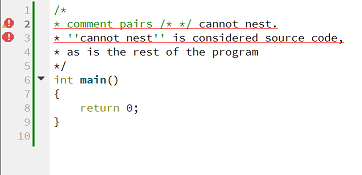
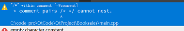

### 练习1.6
不合法，修改为：
```cpp
std::cout << "The sum of " << v1 << " and " << v2 << " is " << v1 + v2 << std::endl;
```

### 练习1.7
> 编译一个包含不正确的嵌套注释的程序，观察编译器返回的错误的信息。




### 练习1.8 
> 指出下面哪些输出语句是合法的(如果有的话)
```
其中只有最后一个是非法的，其他的是合法。
```

### 练习1.12
> 下面的for循环完成了什么功能？ sum的终值是多少？
```cpp
int sum = 0;
for(int i = -100; i <= 100; ++i)
    sum += i;
```
循环完成了-100到100相加, sum 的结果终值是 0 。

### 练习1.13
> 使用for循环重做1.4.1节中的所有练习(第11页)。
ex 1.9
```cpp
#include <iostream>

int main()
{
    int sum = 0;
    for (int i = 50; i <= 100; ++i) sum += i;
    std::cout << "the sum is: " << sum << std::endl;

    return 0;
}
```
ex 1.10
```cpp
#include <iostream>

int main()
{
    for (int i = 10; i >= 0; --i)
        std::cout << i << std::endl;
    return 0;
}
```
ex 1.11
```cpp
#include <iostream>

int main()
{
    std::cout << "please input two integers:\n";
    int small = 0, big = 0;
    std::cin >> small >> big;

    if (small > big)
    {
        int tmp = small;
        small = big;
        big = tmp;
    }

    for (int i = small; i != big; ++i)
        std::cout << i << std::endl;

    return 0;
}
```


